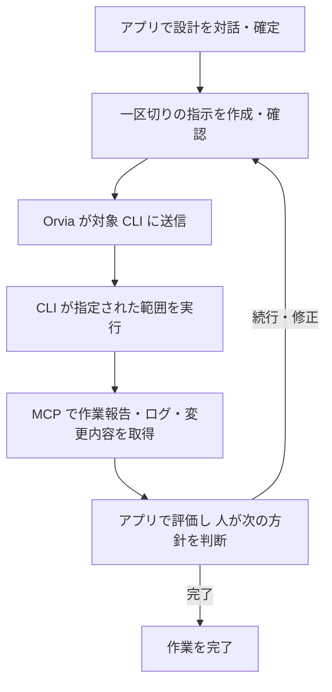

# Orvia の仕様・要件

## 文書の位置付け

この文書を製品要件と目指す動作の正本とする。要件を変更する場合は、この文書と対応する
受け入れ条件を更新する。過去の設計経緯や比較案を、現在の仕様として並べない。

ここに記載した動作がすべて実装済みという意味ではない。
[現在の実装状況](#現在の実装状況)で、実現できることと不足を区別する。
現行版の操作手順は [現行実装の利用ガイド](current-implementation.md)、用語の定義は
[CONTEXT.md](../CONTEXT.md)を参照する。利用ガイドは現行コードの説明であり、製品要件を上書きしない。

## 目的と基本フロー

ChatGPT.app または Claude.app で設計とレビューを対話形式で行い、開発自体は CLI で行う。
Orvia は MCP を通じて、指示の送信、作業の識別、ログ・サマリー・変更内容の取得を提供する。

**アプリで設計を確定 → CLI に一区切りを依頼 → アプリで結果を評価 →
人が次の方針を判断 → 評価と判断を含む次のプロンプトを CLI に送信する。**

## 責任分担

| 担当                     | 責任                                                                           |
| ------------------------ | ------------------------------------------------------------------------------ |
| 人                       | 設計の確定、指摘の採用・不採用、続行・修正・完了の判断                         |
| ChatGPT.app / Claude.app | 設計の対話、結果の評価、人の判断を含めた次のプロンプトの作成                   |
| Orvia                    | 記録、worktree・ブランチの識別、CLI への送信、結果の取得、実行と判断待ちの管理 |
| 開発用 CLI               | 指示された範囲内での実装・テスト・必要な修正、結果の報告                       |

AI の評価と人の採用判断を区別する。Orvia 自体に対話 AI や別のレビュー画面を設けることは、
この要件に含めない。チャットセッションやターミナルを、作業の識別子にしない。

## 機能要件

### 設計の確定

- Plan ごとに目的・範囲・制約・受け入れ条件をまとめた設計版を記録する。
- 最初の実行は、アプリでの対話から確定した設計版を参照する。
- 設計の変更は新しい版として記録し、過去の実行が参照した版を書き換えない。
- 判断を変更する場合は、以前の判断と新しい判断の関係を残す。
- 会話全文の保存は必要条件としない。実行に必要な確定内容と判断を記録する。

### 作業対象の識別

- 一つの Plan に複数の Work Item を関連付けられる。
- Work Item は一つのブランチ・worktree に対応し、複数の区切りで進められる。
- アプリから Work Item、リポジトリ、worktree、ブランチ、実行状態を判別できる。
- 変更・送信は明示的な対象 ID を使う。対象が曖昧なときは推測で実行しない。
- 実行直前に workspace identity を検証し、不一致や detached HEAD で起動しない。
- 同じ Work Item で同時に複数の実行を開始しない。

### 指示の準備と送信

- 準備と送信を分ける。準備では CLI を起動しない。
- 準備したプロンプトは、対象、設計版、Agent Profile、送信全文を取得できる。
- 全文に作業範囲・終了条件・確定した設計・有効な判断を含める。
  続きの区切りには、前の作業報告・アプリでの評価・人の判断を結び付ける。
- 人の送信指示により、確認した全文をそのまま CLI に渡す。
  送信時に記録から全文を作り直したり、内容を暗黙に変更したりしない。
- 準備後に関連する設計・判断・workspace・コード状態が変わった場合は、再準備を要求する。
- 一つの送信プロンプトを一つの Run に対応付ける。同じ送信の再試行で二重起動しない。
- 人の指示は MCP クライアントが表現する。Orvia が会話中の発言者やクリックを独立に
  認証できることは前提にしない。追加の定型的な確認画面は必須にしない。

### 区切りの実行と判断待ち

- 区切りは、確認したプロンプトで指定した作業範囲を実行して結果を返す単位とする。
- 区切りの中では CLI が実装・テスト・テストで見つかった問題の修正を自律的に行える。
  コマンドやファイル編集のたびに人の判断を要求しない。
- 終了条件を満たした場合、必要な情報がない場合、または範囲外の判断が必要な場合に結果を返す。
- 区切りが終わると、人の評価と次の指示を待つ。
  別の Run、CLI レビュー、修正サイクルを自動で開始しない。
- 実行成功と人による受け入れ完了を区別する。終了コードだけで作業を完了扱いにしない。
- 判断待ちの契約は MCP と CLI の両方に適用し、別の入口から迂回できないようにする。

### 作業報告とレビュー

- 手動実行でも構造化した作業報告を取得できる。
  報告には変更概要、終了状態、確認した内容と結果、未解決事項、必要な判断を含める。
- エージェントが報告した確認結果と、Orvia が取得した Git の情報を区別する。
  エージェント報告を Orvia によるコマンド実行の証明として扱わない。
- 不正な報告、失敗、中断では、欠落・部分結果・原因を明示する。成功した報告を補作しない。
- MCP から作業報告、生ログ、変更ファイル一覧、差分、必要なソースを取得できる。
  未追跡ファイルの内容も確認できる。
- 差分には比較基準の commit、取得時点、コード状態の識別情報、完全性を付ける。
  Work Item の基準からの累積差分と、その区切りで変更されたファイル一覧を区別する。
- 取得を分割する場合は、続きの取得方法と未取得部分を明示する。
  欠落や打ち切りのある結果を、変更全体のレビュー材料として扱わない。
- コードが報告時点から変わった場合は、現在の内容を過去時点の内容と表示しない。
- 生ログは、期限切れ・打ち切り・取得不能を区別して返す。

### 記録の保持

| 記録                                                       | 保持の契約                                                                             |
| ---------------------------------------------------------- | -------------------------------------------------------------------------------------- |
| 設計版、送信プロンプト全文と対象、作業報告、評価、人の判断 | 再起動後も取得でき、通常の自動 cleanup で消さない                                      |
| 実行の一時的なメタデータ                                   | 既存の件数制限で間引けるが、作業報告と判断の関係は壊さない                             |
| 生ログ、未検証の構造化出力                                 | 容量・保存期限のある cache に置き、欠落を明示する                                      |
| ソース・差分の全文                                         | Git と worktree から取得する。過去時点の完全なスナップショット保存は初期範囲に含めない |

プロンプトは、後から送信内容を確認するための永続記録とする。通常の診断ログには出さない。
cache の削除や Run メタデータの間引きで、送信内容・報告・判断を取得できなくしない。

### 中断と再開

- 実行の停止、作業の中断、再開の判断を明示的に行える。
- 停止を確認できないときは、停止成功と表示しない。
- daemon 再起動や移行で実行を自動再開しない。
- クラッシュ後に起動の成否が不明なら、その状態を明示して人の判断を待つ。
- 容量不足や報告保存の失敗で、成功扱いや次の実行への自動継続をしない。
  状態確認と可能な停止・cleanup の経路を維持する。

### アプリ接続

- ChatGPT.app または Claude.app を、設計・評価の主な窓口として利用できるようにする。
- SDK client の試験と、実アプリでの接続・操作確認を区別する。
- 対応を示すアプリごとに、版・環境・接続方式・確認結果を記録する。
  未検証の接続を検証済みと表示しない。
- 初期経路はローカルの STDIO MCP を使う。接続方法は対象アプリの仕様に合わせて確認する。
  hosted 環境等で別の経路が必要な場合は、ローカル接続と区別して案内する。
- 明示的な結果取得で往復を成立させる。プッシュ通知は初期実装の必須条件としない。

## 技術的な制約

### リポジトリと実行の境界

- Orvia の設定・状態・cache は利用者のローカル領域に保存する。
  対象リポジトリに管理用ファイルや ignore 設定を書き込まない。
- CLI の作業ディレクトリは Work Item の紐付けから決める。
  ソース取得は bound worktree 内の実体を対象とし、範囲外に解決する参照は拒否する。
- Agent Profile と adapter を用い、必要な能力と利用可能な能力を起動前に確認する。
  使えない Profile を別のものに自動置換しない。
- CLI の既存の認証を利用し、Orvia に認証情報を保存しない。
- ファイル操作の制限は各 adapter の機構に依存する。
  workspace identity の検証を、Orvia 独自の OS sandbox と説明しない。
- 現行の停止処理が対象とするのは macOS/Linux の process group 内のプロセスである。
  group を離れた子プロセス、強制終了後の残存プロセス、Windows の子プロセス停止まで保証したと表示しない。

### ストレージ契約

- SQLite は daemon だけが開き、MCP と CLI は共通の application 操作を経由する。
  エージェントの実行中に書き込み transaction を保持しない。
- `storage.database_max_mb` は DB、rollback journal、残存 WAL/SHM、migration backup の合計の
  hard budget とする。通常の書き込み、起動時の回復、migration 中も超えない。
- 制御・保守に必要な余地を確保し、容量不足の書き込みは拒否または rollback する。
  新しい永続記録を追加するときも、この契約を維持する。
- migration は version と checksum を検証し、実行前の容量確認、backup、失敗時の rollback を行う。
  既に適用した migration を編集しない。対応版より新しい DB を変更せず拒否する。
- cleanup は Orvia の記録・cache・backup だけを対象とし、リポジトリ・worktree・branch・commit を変更しない。
- 構造化報告には既存の承認済みフィールド上限を適用する。超過した報告を黙って切り詰めない。
  新たな容量・保持期間・回数の値は、この文書で独自に追加しない。

### 外部依存

必要な機能は、Node.js 標準機能、既存のシステム機能、採用済み依存を先に検討する。
新しい依存を加える場合は、内製・維持する費用と導入・保守・セキュリティ対応の費用を比較する。
必要性、保守状況、推移的依存、install script/native code、固定方法をレビューする。
複雑なプロトコルや暗号処理を、依存削減だけを理由に独自実装しない。

runtime 依存は `docs/runtime-dependencies.txt` と lockfile の一致を確認する。
Node.js/SQLite の変更では、保存容量・migration・crash recovery・process lifecycle の互換性を検証する。
具体的な開発チェックは [CONTRIBUTING.md](../CONTRIBUTING.md)に従う。

### 開発環境

TypeScript と Node.js、git、SQLite を使う既存基盤を活かす。
Node.js の必要版は `package.json`、再現可能な開発環境は `flake.nix`/`flake.lock`、
npm 依存は `package-lock.json` を基準にする。Nix は開発環境であり、製品利用の必須条件にしない。
macOS/Linux を初期対象とし、Windows の動作確認は未完了として扱う。

## 初期実装の範囲

- CLI は Orvia が区切りごとに非対話実行として新規起動する。
  設計、前の報告・評価、人の判断をプロンプトへ含めて継続性を支える。
  同じネイティブ CLI セッションの継続や、自分で開いたターミナルへの送信は初期範囲に含めない。
- 現在の自動サイクルは明示的に選ぶ互換機能とする。標準設定では起動・再開を拒否し、
  過去の履歴は取得できるようにする。同じ Work Item で標準の流れと併用しない。
- 既存の `start_run` も設計確定・準備した指示の送信・判断待ちの契約に移行する。
  既存データを、人が確定した設計や確認済みプロンプトとして自動認定しない。
- API 名、SQL の細部、追加の transport は実装上の選択とし、別の製品要件を増やす根拠にしない。
- worktree/branch 作成、rollback、PR 作成・merge、cloud sync、独自 dashboard、
  サービス配布方式の拡張は、今回の基本フローの完了条件に含めない。

## 受け入れ条件

| 要件             | 観測可能な合格条件                                                                                           |
| ---------------- | ------------------------------------------------------------------------------------------------------------ |
| 設計確定         | 確定版を取得でき、未確定では標準実行を開始しない。設計変更後も過去の参照版が変わらない                       |
| 対象識別         | 複数 Work Item の worktree・branch をアプリから判別でき、不一致の対象で起動しない                            |
| 指示の準備・送信 | 準備では起動せず、確認した全文・対象と実際の実行入力・cwd が一致する                                         |
| 区切りと判断     | 区切り内は実装・テストを進められ、終了後に別の実行を勝手に起動しない。次の指示に前の評価・人の判断が結び付く |
| アプリレビュー   | 作業報告、ログ、追跡・未追跡ファイルの変更内容を読め、比較基準・コード状態・未取得部分を判別できる           |
| 記録保持         | 再起動、cache 削除、Run メタデータ間引き後も設計・送信全文・作業報告・評価・判断を取得できる                 |
| 異常時           | 二重送信、準備後の変更、crash、容量不足、不正な報告で二重起動や自動続行が起きず、原因を取得できる            |
| 入口の一貫性     | MCP と CLI の両方に判断待ちが適用され、自動サイクルを明示的に選ばない標準操作で迂回しない                    |
| 実アプリ         | 対象アプリで設計確定→送信→結果取得→評価・人の判断→続行または完了を実行し、環境と結果を記録する               |

## 現在の実装状況

以下はこの仕様に対する実装状況であり、今後の動作を実装済みと表すものではない。

| 項目         | 現在できること                                                                                                | この仕様に対する不足・検証状態                             |
| ------------ | ------------------------------------------------------------------------------------------------------------- | ---------------------------------------------------------- |
| 設計・判断   | `confirm_design` で不変の設計版を追加し、`get_plan` で履歴を取得。未確定では準備を拒否する                    | 実装・契約検証済み                                         |
| 対象識別     | worktree 発見、紐付け、状態取得、準備・送信前の再検証                                                         | 実アプリで複数 Work Item を判別する往復は未検証            |
| CLI 送信     | `prepare_prompt` で全文・対象を保存し、`start_run({checkpointId})` で保存全文を送信。変更・重複送信を検査する | 実装・MCP/CLIの往復検証済み                                |
| 判断待ち     | 終了後は `awaiting_review`。評価と人の判断を `record_checkpoint_review` で記録し、次の準備に結び付ける        | 実アプリでの続行・修正・完了の往復は未検証                 |
| 作業報告     | 手動 Run の構造化報告と欠落原因を checkpoint に保持。生ログは期限切れ・打ち切り・取得不能を区別する           | cleanup・Run 間引き・異常時を含む契約検証済み              |
| 変更内容     | MCP/CLI から累積差分・未追跡内容・ソースページ、基準・fingerprint・完全性、区切りの変更ファイルを取得できる   | 契約検証済み。過去ソース全文と submodule snapshot は対象外 |
| 自動サイクル | 明示的な互換設定で起動・再開。標準では拒否し、既存履歴を保持。区切りを送信済みの Work Item との併用を拒否     | 互換試験を標準フローの完成根拠にはしない                   |
| アプリ接続   | STDIO MCP の SDK/protocol client 試験がある                                                                   | ChatGPT.app / Claude.app での実接続と基本フローは未検証    |

1B・1C・2A・2B は実装・契約検証済み。全292テスト、型、lint、依存一覧、build が通過した。
schema version 3 の migration は
設計版・checkpoint の永続記録を追加するが、旧 Run を確認済み区切りに自動認定しない。
実アプリの確認が残るため、仕様全体の完了とは扱わない。

## 実装の順序

1. 設計確定、プロンプトの準備・送信、一区切りの実行と判断待ちを実装する。
   既存 API と自動サイクルも同じ変更で適用範囲を整える。
2. 手動実行の構造化報告と永続記録、ログの欠落表示、MCP での変更内容取得を実装する。
3. 実アプリで基本フローを確認し、利用ガイドと実装状況を更新する。

製品要件に対する合否は上記の受け入れ条件で判断する。
現在の自動サイクルの試験が成功したことを、新しい基本フローが完成した根拠にしない。
具体的な作業順序と進捗は [修正計画](implementation-plan.md)を参照する。
